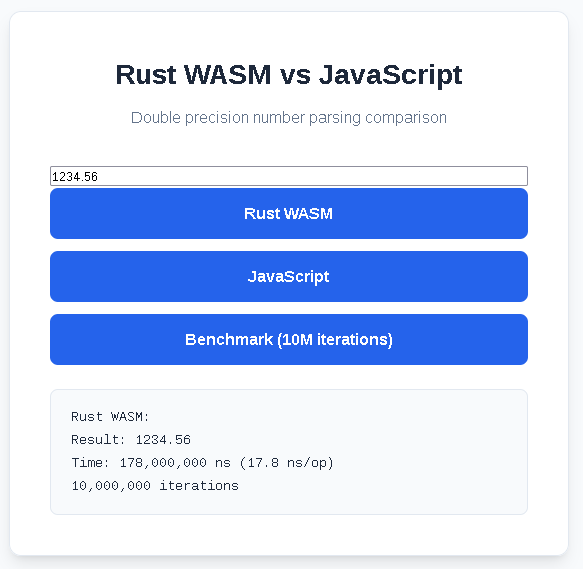

# Parser Benchmark: Rust WASM vs JavaScript

## Build & Run

```bash
# Build WASM module in wasm-parser directory
wasm-pack build --target web --out-dir pkg

# Start local server in project root directory

npx serve .
```

````

Open `http://localhost:3000`

## Project Structure

```
.
├── index.html          # UI and benchmark controls
├── styles.css          # Stylesheet
├── wasm-parser/        # Rust WASM module
│   ├── Cargo.toml
│   ├── src/lib.rs
│   └── pkg/            # Generated WASM output
└── README.md
```

## Usage

1. Enter a number in the input field
2. Click **Rust WASM** or **JavaScript** to test
3. Click **Benchmark** to compare both (10M iterations)

## Screenshot



## Technologies

- Rust + WebAssembly (`wasm-bindgen`)
- JavaScript (native `parseFloat()`)
- `wasm-pack` build tool
- HTML + CSS

## License

MIT
````
